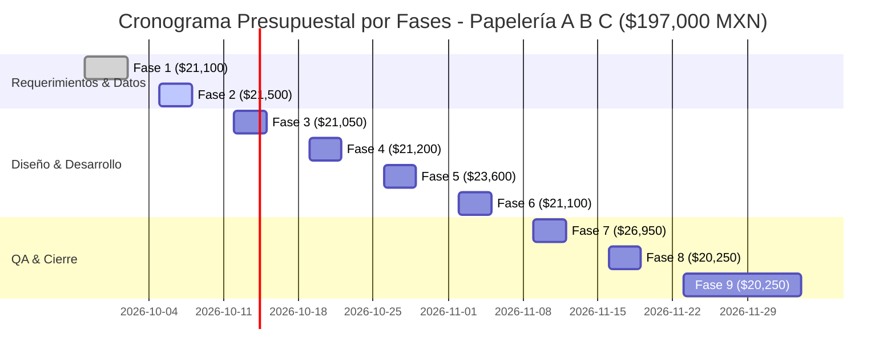

# FASE 1: ESTUDIO DE FACTIBILIDAD ECONÓMICA Y PRESUPUESTO DEL PROYECTO
## Sistema de Administración y Venta para "Papelería A B C"
**Empresa:** Papelería A B C  
**Identidad Visual:** Logotipo Oficial Integrado (`LOGO.jpg`)  
**Materia:** Ingeniería de Software  
**Equipo de Desarrollo:**  
- **Gerardo Cabrera Morales** (Líder Técnico & Desarrollador Fullstack)  
- **Astrid García Ramírez** (Analista de Datos, DBA & Especialista QA)  
- **Daniel Parada Gonzalez** (Arquitecto de Persistencia, Seguridad & UI/UX)  
**Periodo Fase 1:** Semana 1 (28 de Septiembre al 02 de Octubre de 2026)  
**Estatus:** Concluido y Aprobado  

---

  
  <h3>Análisis Financiero de Inicio de Proyecto e Imputación de Costes de la Fase 1</h3>

---

## 1. Justificación Económica y Objetivos de la Fase 1

En la **Fase 1: Planteamiento y Requerimientos**, además de delimitar los requerimientos funcionales (RF-01 a RF-08) y no funcionales (RNF-01 a RNF-06) para **Papelería A B C**, se llevó a cabo el análisis de viabilidad técnica y económica del proyecto.

El desarrollo de un sistema a la medida con arquitectura **Web App Local Offline (HTML5/ES6 + IndexedDB)** ofrece un retorno de inversión (ROI) altamente favorable frente a soluciones comerciales convencionales:
1. **Cero costos recurrentes de licenciamiento por suscripción:** No se pagan mensualidades ni licencias SaaS tipo Shopify o QuickBooks.
2. **Cero costos de infraestructura en la nube o servidores dedicados:** El software se ejecuta directamente en el equipo del mostrador.
3. **Independencia de conexión a Internet:** Cero pérdidas de ventas por caídas de red o fallas del proveedor de telecomunicaciones.

---

## 2. Coste Económico de la Fase 1 (Semana 1)

El presupuesto asignado y ejercido para la ejecución de la **Fase 1** asciende a:

$$\mathbf{\$21,100.00\text{ MXN}}\quad\text{(Veintiún mil cien pesos 00/100 M.N.)}$$

### 2.1 Desglose de Gastos de la Fase 1

| Concepto de Gasto | Descripción Técnica | Cantidad | Costo Unitario | Importe Total (MXN) |
|---|---|:---:|:---:|:---:|
| **Honorarios Gerardo Cabrera Morales** | Líder Técnico & Fullstack (25 hrs a $250/h) | 25 hrs | $250.00 | $6,250.00 |
| **Honorarios Astrid García Ramírez** | Analista de Requerimientos & QA (25 hrs a $240/h) | 25 hrs | $240.00 | $6,000.00 |
| **Honorarios Daniel Parada Gonzalez** | Arquitecto de Software & UI/UX (25 hrs a $240/h) | 25 hrs | $240.00 | $6,000.00 |
| **Subtotal Mano de Obra Directa (MOD)** | **Nómina de los 3 desarrolladores en Fase 1** | **75 hrs** | — | **$18,250.00** |
| **Infraestructura Git & Repositorio** | Repositorio privado institucional y CI/CD | 1 lic. | $850.00 | $850.00 |
| **Gastos Operativos Indirectos** | Conectividad simétrica, electricidad y estación | 1 sem. | $500.00 | $500.00 |
| **Fondo de Contingencia de Fase** | Reserva para variaciones en alcance y elicitación | 1 | $1,500.00 | $1,500.00 |
| **TOTAL EJERCIDO EN FASE 1** | **Planteamiento, Historias y Requerimientos** | — | — | **$21,100.00** |

---

## 3. Contexto dentro del Presupuesto Global del Proyecto ($197,000.00 MXN)

La Fase 1 representa el **10.71%** del presupuesto global del proyecto ($197,000.00 MXN), el cual abarca las 9 semanas de desarrollo hasta la puesta en marcha final:

### 3.1 Tabulador Global de Fases del Proyecto

| Fase | Semana | Enfoque | Costo Total (MXN) | Estado |
|:---:|:---:|---|:---:|:---:|
| **01** | Sem 1 | Planteamiento y Requerimientos (PDF Inicial) | **$21,100.00** | **Completado** |
| **02** | Sem 2 | Análisis y Modelado de Datos (DER + 3FN) | **$21,500.00** | **Completado** |
| **03** | Sem 3 | Arquitectura y Prototipado UI | **$21,050.00** | Programado |
| **04** | Sem 4 | Sprint 1: Módulo de Inventario | **$21,200.00** | Programado |
| **05** | Sem 5 | Sprint 2: Punto de Venta (POS) | **$23,600.00** | Programado |
| **06** | Sem 6 | Sprint 3: Reportes y Seguridad | **$21,100.00** | Programado |
| **07** | Sem 7 | Pruebas de Software (QA) | **$26,950.00** | Programado |
| **08** | Sem 8 | Documentación y Manuales | **$20,250.00** | Programado |
| **09** | Sem 9 | Evaluación Final y Exposición | **$20,250.00** | Programado |
| **TOTAL** | **9 Semanas** | **Proyecto Completo Papelería A B C** | **$197,000.00** | **100.0%** |

---

## 4. Compromiso de Cumplimiento Económico y Firmas

| Responsabilidad | Nombre y Firma | Rol |
|:---:|:---:|:---:|
| **Líder de Proyecto** | _____________________________ **Gerardo Cabrera Morales** | Desarrollador Fullstack & Estimador Técnico |
| **Control de Calidad** | _____________________________ **Astrid García Ramírez** | Analista de Datos, DBA & QA |
| **Arquitectura de Software** | _____________________________ **Daniel Parada Gonzalez** | Arquitecto de Software & UI/UX |
