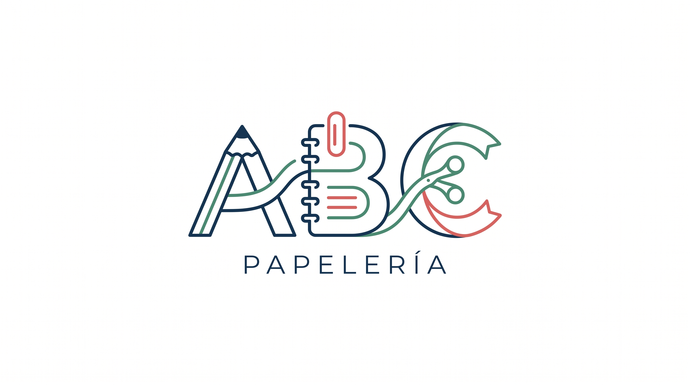
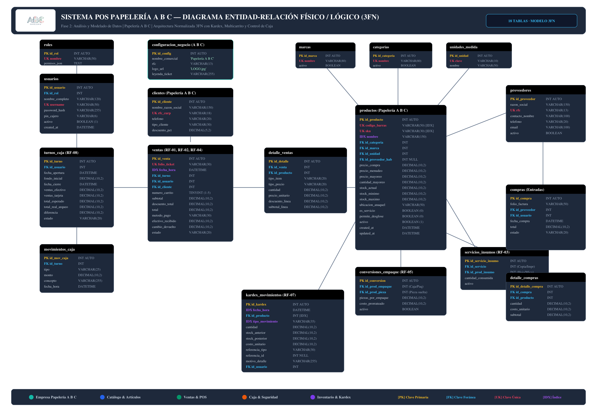
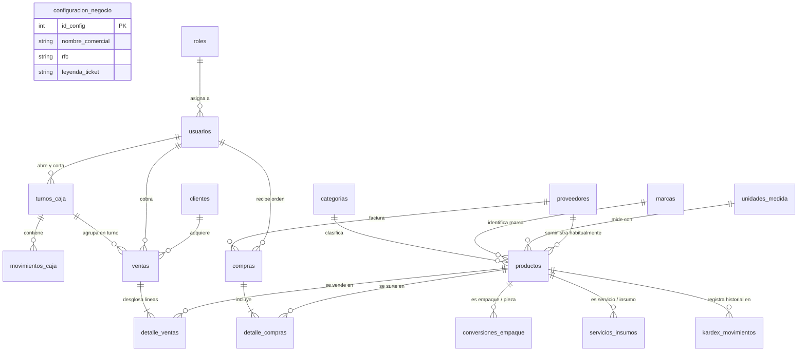
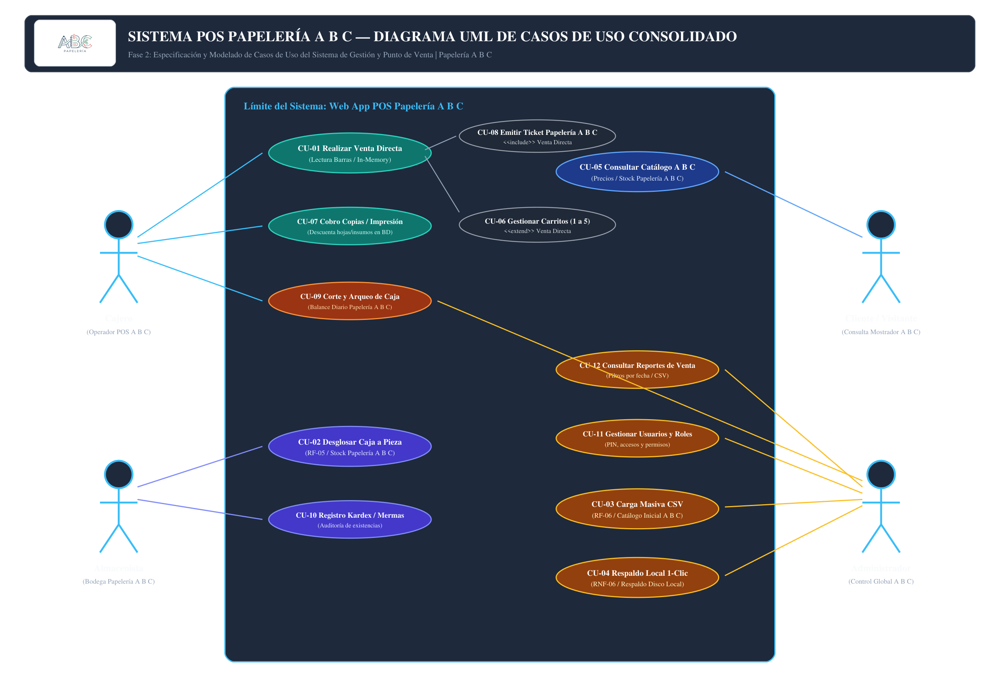
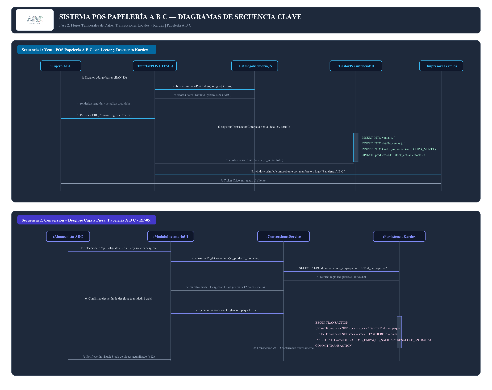
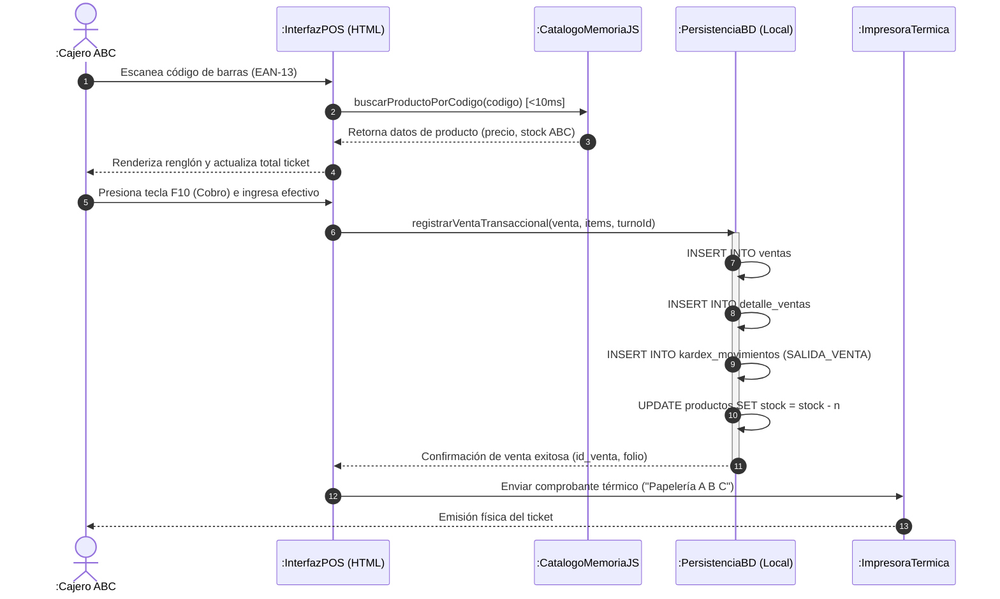
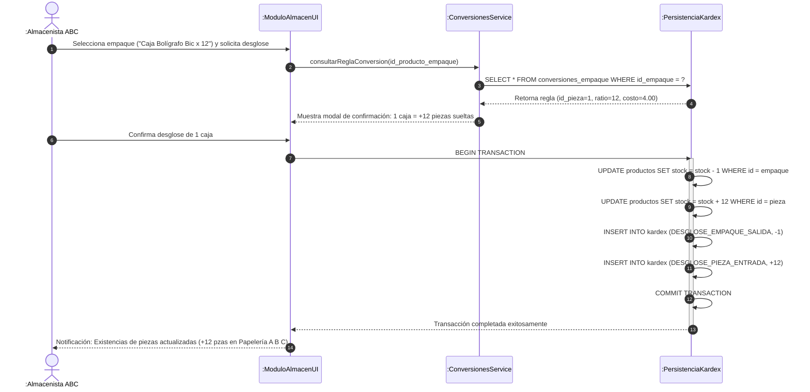

<div align="center">
  
</div>

# SISTEMA POS PARA "PAPELERÍA A B C" — FASE 2: ANÁLISIS Y MODELADO DE DATOS
**Documento Técnico de Especificación de Base de Datos, Normalización (3FN), Casos de Uso y Secuencias**

---

### Portada y Metadatos del Proyecto

| Campo | Detalle |
|---|---|
| **Proyecto** | Sistema de Administración y Venta para **Papelería A B C** (Web App Local) |
| **Nombre Comercial** | **Papelería A B C** |
| **Identidad Visual** | **Logotipo Oficial Integrado (`LOGO.jpg`)** |
| **Fase del Calendario** | **Fase 2: Análisis y Modelado de Datos (Semana 2)** |
| **Entregable Principal** | **Diagrama Entidad-Relación (DER) + Documento de Soporte** |
| **Materia** | Ingeniería de Software |
| **Equipo de Desarrollo** | **Gerardo Cabrera Morales**<br>**Astrid García Ramírez**<br>**Daniel Parada Gonzalez** |
| **Presupuesto Fase 2** | **$21,500.00 MXN** (Presupuesto Global del Proyecto: **$197,000.00 MXN**) |
| **Versión del Modelo** | 2.0 (Normalizado en 3FN, Soporte SQL ANSI & IndexedDB) |
| **Estado** | Completo y Validado |

---

## 1. Introducción y Objetivos de la Fase 2

El presente documento formaliza la **Fase 2: Análisis y Modelado de Datos** para el **Sistema POS de la "Papelería A B C"**. Esta fase toma como base los requerimientos funcionales (RF-01 a RF-08) y requerimientos no funcionales (RNF-01 a RNF-06) definidos y aprobados en la **Fase 1**, estructurando la persistencia del sistema de forma robusta, escalable y normalizada para el negocio.

### 1.1 Objetivos Específicos
1. **Diseñar el modelo de datos relacional:** Abarcar el catálogo de artículos de **Papelería A B C**, la identidad institucional para tickets, la gestión de ventas multicarrito, el control de turnos y cortes de caja, y la auditoría completa de inventario mediante Kardex.
2. **Normalizar el modelo hasta la Tercera Forma Normal (3FN):** Garantizar la ausencia de redundancias, anomalías de inserción, actualización y borrado.
3. **Elaborar el Diccionario de Datos completo:** Definir exhaustivamente atributos, tipos, longitudes, restricciones de dominio, claves primarias/foráneas y reglas de validación.
4. **Construir el Diagrama Entidad-Relación (DER):** Entregable oficial de la fase, diseñado a nivel físico/lógico con cardinalidades explícitas e índices de alto desempeño.
5. **Modelar los Diagramas de Casos de Uso y Secuencia clave:** Documentar el comportamiento dinámico y el flujo temporal de las transacciones principales.
6. **Alinear la persistencia:** Proporcionar scripts SQL ANSI listos para ejecución (`schema.sql`) y su correspondiente mapeo a **IndexedDB** (`schema_indexeddb.js`) para garantizar el funcionamiento 100% offline y respuesta inferior a 10 ms en el navegador.

---

## 2. Requerimientos de Negocio e Identidad de Papelería A B C

### 2.1 Identidad de Marca y Logotipo Oficial (`LOGO.jpg`)
La identidad gráfica de la papelería está plasmada en el archivo `LOGO.jpg`, el cual forma parte de la arquitectura del software:
- **Concepto Gráfico:**
  - **A**: Estilizada mediante un **lápiz escolar de grafito** con punta afilada, cuerpo de madera, virola metálica y borrador rojo.
  - **B**: Estilizada mediante un **cuaderno / libreta de espiral** con lomo anillado y hojas de notas.
  - **C**: Estilizada mediante unas **tijeras escolares** con empuñadura ergonómica de plástico y hojas de corte.
  - **Texto Inferior:** La leyenda "**PAPELERÍA**" en tipografía institucional sólida y legible.
- **Paleta Cromática Oficial:**
  - **Azul Marino Primario:** `#152c4a` (institucionalidad, formalidad y contraste).
  - **Verde Esmeralda:** `#3a8e63` (material escolar, creatividad y dinamismo).
  - **Rojo Cereza:** `#d9534f` (energía, ofertas y destaque en puntos de venta).
- **Implementación Técnica en el Sistema:**
  - **Base de Datos:** Almacenado en `configuracion_negocio.logo_url = 'LOGO.jpg'`.
  - **Membrete de Tickets:** Se integra en la cabecera de tickets térmicos mediante mapa de bits monocromático.
  - **Interfaz de Usuario:** Posicionado en la barra de navegación superior (Navbar) y pantalla de bloqueo de turno.
  - **Entregables de Ingeniería:** Todos los diagramas de arquitectura (DER, Casos de Uso, Secuencias) incorporan el logotipo como membrete institucional oficial.

### 2.2 Dinámicas Comerciales de Papelería A B C Integradas al Modelo
A diferencia de un punto de venta genérico, **Papelería A B C** posee dinámicas comerciales particulares que se han integrado directamente en el diseño del modelo de datos:

1. **Identidad Institucional y Personalización (Tabla `configuracion_negocio`):**
   - El sistema almacena los datos fiscales y comerciales de **Papelería A B C** (nombre comercial, razón social, RFC, dirección, teléfono, lema y pie de ticket) para imprimir de forma automática en los comprobantes de venta y cabeceras de reportes.
2. **Venta Suelta vs. Venta por Empaque (Conversión Caja a Pieza - RF-05):**
   - Los productos se compran frecuentemente en cajas o paquetes mayoristas (ej. Caja de 12 bolígrafos Bic, Paquete de 500 hojas bond), pero se comercializan tanto por caja como por unidad individual suelta.
   - El sistema modela esta relación a través de la entidad `conversiones_empaque`, permitiendo que el personal de **Papelería A B C** despiece un empaque cerrado generando automáticamente los movimientos de salida y entrada en el Kardex.
3. **Servicios de Copiado e Impresión con Deducción de Insumos (RF-03):**
   - Las copias fotostáticas e impresiones no son artículos físicos estáticos, sino servicios cobrados por hoja o pliego que consumen insumos de inventario (papel bond carta, papel oficio, micas de enmicado, espirales de engargolado).
   - Se modela la entidad `servicios_insumos`, que descuenta automáticamente las existencias del insumo correspondiente al cobrar el servicio en el mostrador de **Papelería A B C**.
4. **Venta Multitarea con Múltiples Carritos (RF-02):**
   - En el mostrador de **Papelería A B C** es habitual que un cliente pida un material y luego se retire a buscar otro artículo escolar. El cajero puede pausar la venta en curso y despachar a otro cliente en un carrito alterno (hasta 5 carritos simultáneos) sin perder los artículos escaneados.
5. **Trazabilidad Total de Existencias mediante Kardex (RF-07):**
   - Toda alteración de stock (venta, compra, merma por daño, consumo interno de papelería, desglose o ajuste de inventario) se registra en `kardex_movimientos` con fecha, stock anterior, stock posterior, costo y usuario responsable.
6. **Corte y Balance Diario de Caja (RF-08):**
   - Control estricto de apertura con fondo inicial, registro de entradas y retiros de efectivo durante el turno, y balance final comparando el total esperado contra el arqueo físico para detectar faltantes o sobrantes.

---

## 3. Proceso Formal de Normalización (0FN a 3FN)

Para garantizar la integridad y eficiencia del sistema, el modelo fue sometido al proceso riguroso de normalización en base de datos relacionales:

### 3.1 Forma No Normalizada (0FN) — Estructura Plana Inicial
En un sistema no normalizado o basado en hojas de cálculo tradicionales, las transacciones de mostrador se registraban en un único registro plano repetitivo:

```text
TICKET_VENTA(folio_ticket, fecha, cajero, rol_cajero, cliente, tipo_cliente, 
             codigos_articulos, nombres_articulos, categorias, marcas, 
             cantidades, precios_unitarios, proveedores, subtotal, total, 
             metodo_pago, fondo_caja, balance_caja)
```

**Anomalías identificadas en 0FN:**
- **Atributos multivaluados:** Los artículos vendidos forman una lista o arreglo dentro del mismo registro de ticket.
- **Redundancia:** Los datos del cliente, cajero, categoría y proveedor se repiten en cada producto vendido.
- **Anomalía de modificación:** Si cambia el precio o nombre de un bolígrafo, debe actualizarse en cientos de filas históricas para evitar inconsistencias.
- **Anomalía de borrado:** Si se cancela o elimina un ticket, se corre el riesgo de perder la información del cliente o la existencia del producto.

---

### 3.2 Primera Forma Normal (1FN) — Atomicidad y Clave Primaria
**Reglas aplicadas:**
1. Eliminación de grupos repetitivos y listas de productos dentro del registro.
2. Cada celda de la tabla contiene un único valor escalar atómico.
3. Se establece una clave primaria compuesta para identificar cada registro unívocamente: `(folio_ticket, codigo_barras_producto)`.

**Esquema en 1FN:**
```text
VENTAS_1FN(folio_ticket [PK], codigo_barras [PK], fecha_hora, cajero_nombre, 
           rol_cajero, cliente_nombre, rfc_cliente, tipo_cliente, 
           producto_nombre, categoria_nombre, marca_nombre, unidad_medida, 
           proveedor_nombre, precio_compra, cantidad_vendida, precio_unitario, 
           subtotal_linea, total_ticket, metodo_pago)
```

**Problema persistente en 1FN:**  
Existen **dependencias funcionales parciales**. La clave primaria es compuesta `(folio_ticket, codigo_barras)`. Atributos como `fecha_hora`, `cajero_nombre`, `total_ticket` dependen únicamente de `folio_ticket`; mientras que `producto_nombre`, `categoria_nombre`, `precio_compra` dependen únicamente de `codigo_barras`.

---

### 3.3 Segunda Forma Normal (2FN) — Eliminación de Dependencias Parciales
**Reglas aplicadas:**
1. Cumple 1FN.
2. Cada atributo no clave depende funcionalmente de la **totalidad** de la clave primaria, y no de una parte de ella.

**Descomposición en 2FN:**
- **VENTAS_2FN:** Clave primaria `folio_ticket`.
  *(folio_ticket, fecha_hora, cajero_nombre, rol_cajero, cliente_nombre, rfc_cliente, tipo_cliente, total_ticket, metodo_pago)*
- **PRODUCTOS_2FN:** Clave primaria `codigo_barras`.
  *(codigo_barras, sku, producto_nombre, categoria_nombre, marca_nombre, unidad_medida, proveedor_nombre, precio_compra, precio_menudeo, precio_mayoreo, stock_actual)*
- **DETALLE_VENTAS_2FN:** Clave primaria compuesta `(folio_ticket, codigo_barras)`.
  *(folio_ticket, codigo_barras, cantidad_vendida, precio_unitario, subtotal_linea)*

**Problema persistente en 2FN:**  
Existen **dependencias funcionales transitivas**. En `VENTAS_2FN`, `rol_cajero` depende de `cajero_nombre` y éste a su vez de `folio_ticket` (A -> B -> C). De igual manera, `rfc_cliente` y `tipo_cliente` dependen de `cliente_nombre`. En `PRODUCTOS_2FN`, `categoria_nombre` y `proveedor_nombre` generan transitividad sobre los datos del artículo.

---

### 3.4 Tercera Forma Normal (3FN) — Eliminación de Dependencias Transitivas
**Reglas aplicadas:**
1. Cumple 2FN.
2. Ningún atributo no clave depende transitivamente de otro atributo no clave (no existe X -> Y -> Z donde Y no sea superclave).

**Resultado de la normalización en 3FN:**
Se desacoplan completamente las entidades maestras y de catálogo, introduciendo identificadores subrogados (`INT AUTOINCREMENT`) para optimizar indexación y almacenamiento:
0. `configuracion_negocio` (id_config, nombre_comercial, razon_social, rfc, direccion, telefono, email, leyenda_ticket)
1. `roles` (id_rol, nombre, descripcion, permisos_json)
2. `usuarios` (id_usuario, id_rol, nombre_completo, username, password_hash, pin_cajero, activo)
3. `categorias` (id_categoria, nombre, descripcion, activo)
4. `marcas` (id_marca, nombre, activo)
5. `unidades_medida` (id_unidad, clave, nombre, permite_decimales)
6. `proveedores` (id_proveedor, razon_social, rfc, contacto_nombre, telefono, email, direccion)
7. `productos` (id_producto, codigo_barras, sku, nombre, id_categoria, id_marca, id_unidad, id_proveedor_habitual, precios, stocks, flags)
8. `conversiones_empaque` (id_conversion, id_producto_empaque, id_producto_pieza, piezas_por_empaque)
9. `servicios_insumos` (id_servicio_insumo, id_servicio, id_producto_insumo, cantidad_consumida)
10. `clientes` (id_cliente, nombre_razon_social, rfc_curp, telefono, tipo_cliente, descuento_pct)
11. `turnos_caja` (id_turno, id_usuario, fecha_apertura, fondo_inicial, fecha_cierre, totales, arqueo, diferencia, estado)
12. `movimientos_caja` (id_mov_caja, id_turno, id_usuario, tipo, monto, concepto, fecha_hora)
13. `ventas` (id_venta, folio_ticket, fecha_hora, id_turno, id_usuario, id_cliente, numero_carrito, subtotal, iva, total, pago, cambio, estado)
14. `detalle_ventas` (id_detalle, id_venta, id_producto, tipo_item, tipo_precio, cantidad, precio_unitario, descuento, subtotal_linea)
15. `kardex_movimientos` (id_kardex, fecha_hora, id_producto, tipo_movimiento, cantidad, stock_anterior, stock_posterior, costo, referencia, id_usuario)
16. `compras` (id_compra, folio_factura, id_proveedor, id_usuario, fecha_compra, total, estado)
17. `detalle_compras` (id_detalle_compra, id_compra, id_producto, cantidad, costo_unitario, subtotal)

---

## 4. Diagrama Entidad-Relación (DER) — Entregable Principal

El Diagrama Entidad-Relación representa la estructura integral de la base de datos con sus 18 entidades organizadas en dominios funcionales:
- **Empresa y Configuración (Turquesa):** `configuracion_negocio` (Datos institucionales de Papelería A B C).
- **Catálogo y Artículos (Azul):** `categorias`, `marcas`, `unidades_medida`, `proveedores`, `productos`, `conversiones_empaque`, `servicios_insumos`.
- **Ventas y Facturación POS (Verde):** `clientes`, `ventas`, `detalle_ventas`.
- **Caja y Seguridad (Naranja):** `roles`, `usuarios`, `turnos_caja`, `movimientos_caja`.
- **Inventario, Kardex y Compras (Púrpura):** `kardex_movimientos`, `compras`, `detalle_compras`.

### 4.1 Archivos del DER e Identidad Incluidos en esta Entrega
- Vectorial escalable de alta definición: [diagrama_entidad_relacion.svg](file:///C:/Users/gerac/Desktop/ISA/02/diagrama_entidad_relacion.svg)
- Imagen de alta resolución para visualización inmediata: [diagrama_entidad_relacion.png](file:///C:/Users/gerac/Desktop/ISA/02/diagrama_entidad_relacion.png)
- Logotipo oficial institucional: [LOGO.jpg](file:///C:/Users/gerac/Desktop/ISA/02/LOGO.jpg)
- Script DDL ejecutable verificado: [schema.sql](file:///C:/Users/gerac/Desktop/ISA/02/schema.sql)
- Base de datos SQLite compilada con datos muestra: [papeleria_pos.db](file:///C:/Users/gerac/Desktop/ISA/02/papeleria_pos.db)
- Esquema de persistencia local en navegador: [schema_indexeddb.js](file:///C:/Users/gerac/Desktop/ISA/02/schema_indexeddb.js)

<div align="center">
  
  <p><i>Figura 1: Diagrama Entidad-Relación Lógico y Físico Normalizado en 3FN — Papelería A B C (18 Tablas).</i></p>
</div>

### 4.2 Representación Lógica del DER (Mermaid ER)



---

## 5. Diccionario de Datos Exhaustivo

A continuación se detalla la especificación de cada campo para las tablas del sistema:

### 5.0 Tabla: `configuracion_negocio`
*Propósito:* Almacena la identidad institucional, datos fiscales y configuración del ticket de **Papelería A B C**.
| Campo | Tipo | Longitud | Llave | Nulo | Default | Descripción y Reglas de Negocio |
|---|---|---|---|---|---|---|
| `id_config` | INTEGER | 4 bytes | PK | NO | AUTO | Identificador primario de la configuración. |
| `nombre_comercial`| VARCHAR | 100 | — | NO | 'Papelería A B C' | Nombre comercial de la empresa mostrado en encabezados y tickets. |
| `razon_social` | VARCHAR | 150 | — | SÍ | 'Papelería A B C S.A. de C.V.' | Razón social legal para facturación y reportes contables. |
| `rfc` | VARCHAR | 13 | — | SÍ | 'ABC850101XYZ' | Registro fiscal mexicano de Papelería A B C. |
| `direccion` | TEXT | Variable | — | SÍ | — | Dirección física del establecimiento. |
| `telefono` | VARCHAR | 20 | — | SÍ | '555-987-6543' | Teléfono de atención y pedidos. |
| `email` | VARCHAR | 100 | — | SÍ | 'contacto@papeleria-abc.com' | Correo institucional. |
| `leyenda_ticket`| VARCHAR | 255 | — | SÍ | — | Mensaje de despedida impreso al pie de cada ticket. |
| `updated_at` | DATETIME | 8 bytes | — | NO | CURRENT | Marca temporal del último cambio de configuración. |

### 5.1 Tabla: `roles`
*Propósito:* Almacena los roles de seguridad que restringen el acceso a las funciones del POS.
| Campo | Tipo | Longitud | Llave | Nulo | Default | Descripción y Reglas de Negocio |
|---|---|---|---|---|---|---|
| `id_rol` | INTEGER | 4 bytes | PK | NO | AUTO | Identificador primario único del rol. |
| `nombre` | VARCHAR | 50 | UK | NO | — | Nombre descriptivo del rol ('ADMINISTRADOR', 'CAJERO', 'ALMACENISTA'). |
| `descripcion` | VARCHAR | 255 | — | NO | — | Explicación del nivel de acceso y responsabilidades. |
| `permisos_json` | TEXT | Variable | — | SÍ | '{}' | Objeto JSON con directivas de privilegios booleanos. |
| `created_at` | DATETIME | 8 bytes | — | NO | CURRENT | Marca temporal de creación del registro. |

### 5.2 Tabla: `usuarios`
*Propósito:* Cuentas individuales de los operadores del sistema en Papelería A B C.
| Campo | Tipo | Longitud | Llave | Nulo | Default | Descripción y Reglas de Negocio |
|---|---|---|---|---|---|---|
| `id_usuario` | INTEGER | 4 bytes | PK | NO | AUTO | Identificador único de usuario. |
| `id_rol` | INTEGER | 4 bytes | FK | NO | — | Referencia al rol asignado (`roles.id_rol`). |
| `nombre_completo`| VARCHAR | 120 | — | NO | — | Nombre y apellidos del colaborador. |
| `username` | VARCHAR | 50 | UK | NO | — | Nombre de usuario único para inicio de sesión. |
| `password_hash`| VARCHAR | 255 | — | NO | — | Hash criptográfico de contraseña (SHA-256 o bcrypt). |
| `pin_cajero` | VARCHAR | 6 | — | SÍ | NULL | PIN numérico corto para desbloqueo rápido de mostrador. |
| `activo` | BOOLEAN | 1 bit | — | NO | 1 | 1 = Usuario habilitado, 0 = Acceso suspendido. |
| `created_at` | DATETIME | 8 bytes | — | NO | CURRENT | Fecha y hora de alta en el sistema. |

### 5.3 Tabla: `categorias`
*Propósito:* Clasificación por departamento de productos y servicios en Papelería A B C.
| Campo | Tipo | Longitud | Llave | Nulo | Default | Descripción y Reglas de Negocio |
|---|---|---|---|---|---|---|
| `id_categoria` | INTEGER | 4 bytes | PK | NO | AUTO | Identificador primario de categoría. |
| `nombre` | VARCHAR | 80 | UK | NO | — | Nombre del rubro ('Escritura', 'Cuadernos y Papel', etc.). |
| `descripcion` | VARCHAR | 255 | — | SÍ | NULL | Detalle de artículos abarcados. |
| `activo` | BOOLEAN | 1 bit | — | NO | 1 | Estado operativo del rubro. |

### 5.4 Tabla: `marcas`
*Propósito:* Fabricantes y marcas comerciales en catálogo.
| Campo | Tipo | Longitud | Llave | Nulo | Default | Descripción y Reglas de Negocio |
|---|---|---|---|---|---|---|
| `id_marca` | INTEGER | 4 bytes | PK | NO | AUTO | Identificador primario de marca. |
| `nombre` | VARCHAR | 80 | UK | NO | — | Nombre de la marca ('Bic', 'Scribe', 'Pelikan', etc.). |
| `activo` | BOOLEAN | 1 bit | — | NO | 1 | Estado de la marca en catálogo. |

### 5.5 Tabla: `unidades_medida`
*Propósito:* Catálogo de unidades físicas de venta y despacho.
| Campo | Tipo | Longitud | Llave | Nulo | Default | Descripción y Reglas de Negocio |
|---|---|---|---|---|---|---|
| `id_unidad` | INTEGER | 4 bytes | PK | NO | AUTO | Identificador de unidad. |
| `clave` | VARCHAR | 10 | UK | NO | — | Clave estándar ('PZA', 'CJA', 'PQT', 'MTO', 'SRV'). |
| `nombre` | VARCHAR | 50 | — | NO | — | Nombre completo ('Pieza', 'Caja', 'Paquete', 'Metro'). |
| `permite_decimales`| BOOLEAN | 1 bit | — | NO | 0 | 1 para metros o gramos, 0 para artículos enteros. |

### 5.6 Tabla: `proveedores`
*Propósito:* Datos de contacto y fiscales de distribuidores mayoristas de papelería.
| Campo | Tipo | Longitud | Llave | Nulo | Default | Descripción y Reglas de Negocio |
|---|---|---|---|---|---|---|
| `id_proveedor` | INTEGER | 4 bytes | PK | NO | AUTO | Identificador del proveedor. |
| `razon_social` | VARCHAR | 150 | — | NO | — | Razón social o nombre comercial del mayorista. |
| `rfc` | VARCHAR | 13 | UK | SÍ | NULL | Registro fiscal mexicano (12 o 13 caracteres). |
| `contacto_nombre`| VARCHAR | 100 | — | SÍ | NULL | Nombre del agente de ventas o contacto. |
| `telefono` | VARCHAR | 20 | — | SÍ | NULL | Teléfono para levantamiento de pedidos. |
| `email` | VARCHAR | 100 | — | SÍ | NULL | Correo de facturación y cotizaciones. |
| `direccion` | TEXT | Variable | — | SÍ | NULL | Domicilio del almacén o distribuidora. |
| `activo` | BOOLEAN | 1 bit | — | NO | 1 | 1 = Proveedor activo, 0 = Inactivo. |

### 5.7 Tabla: `productos`
*Propósito:* Catálogo central de artículos físicos, insumos y servicios de Papelería A B C (RF-01, RF-03, RF-05).
| Campo | Tipo | Longitud | Llave | Nulo | Default | Descripción y Reglas de Negocio |
|---|---|---|---|---|---|---|
| `id_producto` | INTEGER | 4 bytes | PK | NO | AUTO | Identificador único del producto. |
| `codigo_barras`| VARCHAR | 50 | UK, IDX| NO | — | Código EAN-13, UPC o interno. Búsqueda directa con escáner. |
| `sku` | VARCHAR | 30 | UK, IDX| NO | — | Código alfanumérico mnemotécnico de almacén. |
| `nombre` | VARCHAR | 150 | IDX | NO | — | Descripción comercial visible en pantalla y ticket. |
| `descripcion` | TEXT | Variable | — | SÍ | NULL | Ficha técnica o especificación detallada. |
| `id_categoria` | INTEGER | 4 bytes | FK | NO | — | Categoría a la que pertenece (`categorias.id_categoria`). |
| `id_marca` | INTEGER | 4 bytes | FK | NO | — | Marca del artículo (`marcas.id_marca`). |
| `id_unidad` | INTEGER | 4 bytes | FK | NO | — | Unidad de medida (`unidades_medida.id_unidad`). |
| `id_proveedor_habitual` | INTEGER | 4 bytes | FK | SÍ | NULL | Proveedor preferente de resurtido. |
| `precio_compra`| DECIMAL(10,2)| 8 bytes | — | NO | 0.00 | Costo de adquisición sin IVA (>= 0). |
| `precio_venta_menudeo` | DECIMAL(10,2)| 8 bytes | — | NO | — | Precio regular al público por pieza/unidad. |
| `precio_venta_mayoreo` | DECIMAL(10,2)| 8 bytes | — | NO | — | Precio de mayoreo para escuelas o compras por volumen. |
| `cantidad_mayoreo`| DECIMAL(10,2)| 8 bytes | — | NO | 3.00 | Cantidad mínima para disparar precio de mayoreo. |
| `stock_actual` | DECIMAL(10,2)| 8 bytes | — | NO | 0.00 | Existencia física disponible en tienda y bodega. |
| `stock_minimo` | DECIMAL(10,2)| 8 bytes | — | NO | 5.00 | Umbral para disparar alerta de resurtido automático. |
| `stock_maximo` | DECIMAL(10,2)| 8 bytes | — | NO | 100.00 | Nivel máximo recomendado de existencias. |
| `ubicacion_anaquel`| VARCHAR | 50 | — | SÍ | NULL | Pasillo, vitrina o gaveta física donde se ubica. |
| `es_servicio` | BOOLEAN | 1 bit | — | NO | 0 | 1 si es servicio de copiado/impresión, 0 si es bien físico. |
| `permite_desglose`| BOOLEAN | 1 bit | — | NO | 0 | 1 si es empaque/caja despiezable a unidades sueltas. |
| `activo` | BOOLEAN | 1 bit | — | NO | 1 | 1 = Visible en POS, 0 = Descontinuado. |
| `created_at` | DATETIME | 8 bytes | — | NO | CURRENT | Fecha de alta en inventario. |
| `updated_at` | DATETIME | 8 bytes | — | NO | CURRENT | Fecha de última actualización de datos o precio. |

### 5.8 Tabla: `conversiones_empaque`
*Propósito:* Reglas de equivalencia para desglose automático de cajas/paquetes a piezas sueltas (RF-05 / CU-02).
| Campo | Tipo | Longitud | Llave | Nulo | Default | Descripción y Reglas de Negocio |
|---|---|---|---|---|---|---|
| `id_conversion`| INTEGER | 4 bytes | PK | NO | AUTO | Identificador de la regla. |
| `id_producto_empaque` | INTEGER | 4 bytes | FK | NO | — | Producto empaque cerrado (ej. Caja Bic x 12). |
| `id_producto_pieza` | INTEGER | 4 bytes | FK | NO | — | Producto pieza individual (ej. Bolígrafo Bic suelto). |
| `piezas_por_empaque` | DECIMAL(10,2)| 8 bytes | — | NO | — | Factor multiplicador (piezas contenidas, CHECK > 1). |
| `costo_prorrateado` | DECIMAL(10,2)| 8 bytes | — | SÍ | NULL | Costo por pieza individual derivado de la caja. |
| `activo` | BOOLEAN | 1 bit | — | NO | 1 | Estado de la regla de conversión. |
| `created_at` | DATETIME | 8 bytes | — | NO | CURRENT | Fecha de creación de la regla. |

### 5.9 Tabla: `servicios_insumos`
*Propósito:* Deducción automática de papel, micas y consumibles por cada servicio cobrado (RF-03).
| Campo | Tipo | Longitud | Llave | Nulo | Default | Descripción y Reglas de Negocio |
|---|---|---|---|---|---|---|
| `id_servicio_insumo` | INTEGER | 4 bytes | PK | NO | AUTO | Identificador de la relación servicio-insumo. |
| `id_servicio` | INTEGER | 4 bytes | FK | NO | — | Servicio (`productos.id_producto` donde `es_servicio=1`). |
| `id_producto_insumo` | INTEGER | 4 bytes | FK | NO | — | Insumo físico (`productos.id_producto` ej. Hoja Bond Carta). |
| `cantidad_consumida` | DECIMAL(10,4)| 8 bytes | — | NO | 1.0000 | Cantidad de insumo consumida por unidad de servicio. |
| `activo` | BOOLEAN | 1 bit | — | NO | 1 | Regla activa. |

### 5.10 Tabla: `clientes`
*Propósito:* Registro de clientes para ventas de mostrador, convenios escolares y mayoristas de Papelería A B C.
| Campo | Tipo | Longitud | Llave | Nulo | Default | Descripción y Reglas de Negocio |
|---|---|---|---|---|---|---|
| `id_cliente` | INTEGER | 4 bytes | PK | NO | AUTO | Identificador del cliente. |
| `nombre_razon_social`| VARCHAR | 150 | — | NO | — | Nombre personal o razón social de la institución. |
| `rfc_curp` | VARCHAR | 18 | UK | SÍ | NULL | RFC fiscal o CURP. |
| `telefono` | VARCHAR | 20 | — | SÍ | NULL | Teléfono de contacto. |
| `email` | VARCHAR | 100 | — | SÍ | NULL | Correo para envío de comprobantes digitales. |
| `direccion` | TEXT | Variable | — | SÍ | NULL | Domicilio de entrega o fiscal. |
| `tipo_cliente` | VARCHAR | 30 | — | NO | 'MOSTRADOR'| 'MOSTRADOR', 'FRECUENTE', 'MAYORISTA', 'ESCUELA'. |
| `descuento_pct`| DECIMAL(5,2)| 4 bytes | — | NO | 0.00 | Porcentaje de descuento preferente automático. |
| `activo` | BOOLEAN | 1 bit | — | NO | 1 | Estado del cliente. |

### 5.11 Tabla: `turnos_caja`
*Propósito:* Control de apertura, operación y cierre de caja con balance diario en Papelería A B C (RF-08).
| Campo | Tipo | Longitud | Llave | Nulo | Default | Descripción y Reglas de Negocio |
|---|---|---|---|---|---|---|
| `id_turno` | INTEGER | 4 bytes | PK | NO | AUTO | Identificador único del turno de caja. |
| `id_usuario` | INTEGER | 4 bytes | FK | NO | — | Cajero responsable del turno. |
| `fecha_apertura`| DATETIME | 8 bytes | — | NO | CURRENT | Momento de apertura de caja y registro del fondo. |
| `fondo_inicial`| DECIMAL(10,2)| 8 bytes | — | NO | 0.00 | Efectivo base inicial para dar cambio (morralla). |
| `fecha_cierre` | DATETIME | 8 bytes | — | SÍ | NULL | Momento en que se ejecuta el corte de turno. |
| `total_ventas_efectivo` | DECIMAL(10,2)| 8 bytes | — | NO | 0.00 | Suma acumulada de cobros en efectivo. |
| `total_ventas_tarjeta` | DECIMAL(10,2)| 8 bytes | — | NO | 0.00 | Suma cobrada con terminal bancaria. |
| `total_ventas_transferencia`| DECIMAL(10,2)| 8 bytes | — | NO | 0.00 | Suma recibida vía SPEI/transferencia. |
| `total_entradas_caja` | DECIMAL(10,2)| 8 bytes | — | NO | 0.00 | Dinero extra ingresado al cajón durante el turno. |
| `total_retiros_caja` | DECIMAL(10,2)| 8 bytes | — | NO | 0.00 | Retiros parciales de seguridad o gastos menores. |
| `total_esperado`| DECIMAL(10,2)| 8 bytes | — | NO | 0.00 | Fondo + ventas efectivo + entradas - retiros. |
| `total_real_arqueo` | DECIMAL(10,2)| 8 bytes | — | NO | 0.00 | Efectivo físico contado por el cajero al corte. |
| `diferencia` | DECIMAL(10,2)| 8 bytes | — | NO | 0.00 | Arqueo - Esperado. Positivo = sobrante, Negativo = faltante. |
| `estado` | VARCHAR | 20 | — | NO | 'ABIERTO' | 'ABIERTO' o 'CERRADO'. |
| `observaciones`| TEXT | Variable | — | SÍ | NULL | Notas explicativas de diferencias o incidencias. |

### 5.12 Tabla: `movimientos_caja`
*Propósito:* Auditoría de entradas y salidas extraordinarias de efectivo en caja chica.
| Campo | Tipo | Longitud | Llave | Nulo | Default | Descripción y Reglas de Negocio |
|---|---|---|---|---|---|---|
| `id_mov_caja` | INTEGER | 4 bytes | PK | NO | AUTO | Identificador del movimiento de caja. |
| `id_turno` | INTEGER | 4 bytes | FK | NO | — | Turno en el que ocurrió el movimiento. |
| `id_usuario` | INTEGER | 4 bytes | FK | NO | — | Operador que autorizó/ejecutó el movimiento. |
| `tipo` | VARCHAR | 25 | — | NO | — | 'ENTRADA_FONDO', 'RETIRO_PARCIAL', 'GASTO_CAJA_CHICA'. |
| `monto` | DECIMAL(10,2)| 8 bytes | — | NO | — | Cantidad monetaria (CHECK > 0). |
| `concepto` | VARCHAR | 255 | — | NO | — | Justificación (ej. "Pago de garrafón de agua"). |
| `fecha_hora` | DATETIME | 8 bytes | — | NO | CURRENT | Momento del movimiento. |

### 5.13 Tabla: `ventas`
*Propósito:* Cabecera de venta del mostrador, tickets y carritos simultáneos (RF-01, RF-02, RF-04).
| Campo | Tipo | Longitud | Llave | Nulo | Default | Descripción y Reglas de Negocio |
|---|---|---|---|---|---|---|
| `id_venta` | INTEGER | 4 bytes | PK | NO | AUTO | Identificador de la transacción de venta. |
| `folio_ticket` | VARCHAR | 30 | UK, IDX| NO | — | Folio único impreso en comprobante (ej. 'TCK-2026-0001'). |
| `fecha_hora` | DATETIME | 8 bytes | IDX | NO | CURRENT | Fecha y hora exacta de emisión. |
| `id_turno` | INTEGER | 4 bytes | FK | NO | — | Turno de caja en el que se efectuó el cobro. |
| `id_usuario` | INTEGER | 4 bytes | FK | NO | — | Cajero que realizó la operación. |
| `id_cliente` | INTEGER | 4 bytes | FK | NO | — | Cliente que adquiere la mercancía. |
| `numero_carrito`| INTEGER | 4 bytes | — | NO | 1 | Número de carrito simultáneo activo (1 a 5) (RF-02). |
| `subtotal` | DECIMAL(10,2)| 8 bytes | — | NO | — | Importe antes de descuentos e impuestos. |
| `descuento_total`| DECIMAL(10,2)| 8 bytes | — | NO | 0.00 | Descuento total aplicado al ticket. |
| `iva_total` | DECIMAL(10,2)| 8 bytes | — | NO | 0.00 | Impuesto al valor agregado desglosado. |
| `total` | DECIMAL(10,2)| 8 bytes | — | NO | — | Importe neto a pagar (>= 0). |
| `metodo_pago` | VARCHAR | 30 | — | NO | 'EFECTIVO'| 'EFECTIVO', 'TARJETA', 'TRANSFERENCIA', 'MIXTO'. |
| `efectivo_recibido`| DECIMAL(10,2)| 8 bytes | — | NO | 0.00 | Dinero entregado por el cliente. |
| `cambio_devuelto`| DECIMAL(10,2)| 8 bytes | — | NO | 0.00 | Cambio devuelto al cliente. |
| `estado` | VARCHAR | 20 | — | NO | 'PAGADA' | 'PAGADA', 'CANCELADA', 'EN_ESPERA'. |
| `motivo_cancelacion`| VARCHAR | 255 | — | SÍ | NULL | Causa en caso de cancelación de ticket. |

### 5.14 Tabla: `detalle_ventas`
*Propósito:* Renglones individuales de artículos y servicios comercializados en el ticket.
| Campo | Tipo | Longitud | Llave | Nulo | Default | Descripción y Reglas de Negocio |
|---|---|---|---|---|---|---|
| `id_detalle` | INTEGER | 4 bytes | PK | NO | AUTO | Identificador del renglón. |
| `id_venta` | INTEGER | 4 bytes | FK | NO | — | Ticket de venta padre (`ventas.id_venta`). |
| `id_producto` | INTEGER | 4 bytes | FK | NO | — | Producto o servicio vendido. |
| `tipo_item` | VARCHAR | 20 | — | NO | 'PRODUCTO'| 'PRODUCTO' o 'SERVICIO_COPIAS'. |
| `tipo_precio` | VARCHAR | 20 | — | NO | 'MENUDEO' | 'MENUDEO', 'MAYOREO', 'ESPECIAL'. |
| `cantidad` | DECIMAL(10,2)| 8 bytes | — | NO | — | Unidades vendidas (CHECK > 0). |
| `precio_unitario`| DECIMAL(10,2)| 8 bytes | — | NO | — | Precio unitario cobrado al momento de la venta. |
| `descuento_linea`| DECIMAL(10,2)| 8 bytes | — | NO | 0.00 | Descuento específico del renglón. |
| `subtotal_linea`| DECIMAL(10,2)| 8 bytes | — | NO | — | (cantidad * precio_unitario) - descuento. |

### 5.15 Tabla: `kardex_movimientos`
*Propósito:* Libro mayor de inventario para trazabilidad completa e inmutable de existencias en Papelería A B C (RF-07).
| Campo | Tipo | Longitud | Llave | Nulo | Default | Descripción y Reglas de Negocio |
|---|---|---|---|---|---|---|
| `id_kardex` | INTEGER | 4 bytes | PK | NO | AUTO | Identificador único del movimiento de auditoría. |
| `fecha_hora` | DATETIME | 8 bytes | IDX | NO | CURRENT | Marca temporal del evento en el almacén. |
| `id_producto` | INTEGER | 4 bytes | FK, IDX| NO | — | Producto afectado. |
| `tipo_movimiento`| VARCHAR | 35 | IDX | NO | — | 'VENTA', 'CANCELACION_VENTA', 'COMPRA', 'MERMA_DANO', 'CONSUMO_INTERNO_PAPELERIA', 'DESGLOSE_EMPAQUE_SALIDA', 'DESGLOSE_PIEZA_ENTRADA', 'AJUSTE_INVENTARIO_FISICO'. |
| `cantidad` | DECIMAL(10,2)| 8 bytes | — | NO | — | Magnitud del movimiento en unidades del producto. |
| `stock_anterior`| DECIMAL(10,2)| 8 bytes | — | NO | — | Saldo de inventario previo a la transacción. |
| `stock_posterior`| DECIMAL(10,2)| 8 bytes | — | NO | — | Saldo resultante en inventario después de la transacción. |
| `costo_unitario`| DECIMAL(10,2)| 8 bytes | — | NO | 0.00 | Costo de adquisición unitario para valuación PEPS/Promedio. |
| `referencia_tipo`| VARCHAR | 30 | — | SÍ | NULL | Origen: 'VENTA', 'COMPRA', 'DESGLOSE', 'MANUAL'. |
| `referencia_id` | INTEGER | 4 bytes | — | SÍ | NULL | ID de la tabla referenciada (ej. id_venta o id_compra). |
| `motivo_detalle`| VARCHAR | 255 | — | SÍ | NULL | Justificación del movimiento (ej. "Cuaderno mojado"). |
| `id_usuario` | INTEGER | 4 bytes | FK | NO | — | Colaborador responsable de la acción. |

### 5.16 Tabla: `compras`
*Propósito:* Cabecera de recepciones de mercancía y facturas de distribuidores.
| Campo | Tipo | Longitud | Llave | Nulo | Default | Descripción y Reglas de Negocio |
|---|---|---|---|---|---|---|
| `id_compra` | INTEGER | 4 bytes | PK | NO | AUTO | Identificador único de compra. |
| `folio_factura`| VARCHAR | 50 | — | NO | — | Número de factura o remisión del distribuidor. |
| `id_proveedor` | INTEGER | 4 bytes | FK | NO | — | Proveedor que emite la factura. |
| `id_usuario` | INTEGER | 4 bytes | FK | NO | — | Almacenista que recepciona el pedido. |
| `fecha_compra` | DATETIME | 8 bytes | — | NO | CURRENT | Fecha del documento fiscal o recepción. |
| `subtotal` | DECIMAL(10,2)| 8 bytes | — | NO | 0.00 | Subtotal de compra antes de impuestos. |
| `iva` | DECIMAL(10,2)| 8 bytes | — | NO | 0.00 | IVA de compra. |
| `total` | DECIMAL(10,2)| 8 bytes | — | NO | 0.00 | Total de la compra. |
| `estado` | VARCHAR | 20 | — | NO | 'RECIBIDA'| 'RECIBIDA' o 'CANCELADA'. |
| `observaciones`| TEXT | Variable | — | SÍ | NULL | Incidencias en la entrega del pedido. |

### 5.17 Tabla: `detalle_compras`
*Propósito:* Renglones de artículos recepcionados en cada compra.
| Campo | Tipo | Longitud | Llave | Nulo | Default | Descripción y Reglas de Negocio |
|---|---|---|---|---|---|---|
| `id_detalle_compra`| INTEGER | 4 bytes | PK | NO | AUTO | Identificador del renglón de compra. |
| `id_compra` | INTEGER | 4 bytes | FK | NO | — | Orden de compra padre. |
| `id_producto` | INTEGER | 4 bytes | FK | NO | — | Artículo surtido. |
| `cantidad` | DECIMAL(10,2)| 8 bytes | — | NO | — | Unidades ingresadas físicamente a almacén (> 0). |
| `costo_unitario`| DECIMAL(10,2)| 8 bytes | — | NO | — | Precio unitario facturado por el proveedor. |
| `subtotal` | DECIMAL(10,2)| 8 bytes | — | NO | — | cantidad * costo_unitario. |

---

## 6. Diagramas UML de Casos de Uso y Secuencias Clave

### 6.1 Diagrama General de Casos de Uso del Sistema
- Archivo vectorial: [diagramas_casos_de_uso.svg](file:///C:/Users/gerac/Desktop/ISA/02/diagramas_casos_de_uso.svg)
- Archivo imagen: [diagramas_casos_de_uso.png](file:///C:/Users/gerac/Desktop/ISA/02/diagramas_casos_de_uso.png)

<div align="center">
  
  <p><i>Figura 2: Diagrama UML de Casos de Uso con Actores y Módulos — Papelería A B C.</i></p>
</div>

#### Actores del Sistema en Papelería A B C:
1. **Cajero:** Opera el punto de venta en mostrador (búsqueda de producto, cobro de copias, multicarrito, corte de caja y emisión de ticket con membrete).
2. **Almacenista:** Gestiona el stock físico de bodega, recepción de compras, registro de mermas y ejecución de desgloses de empaque a pieza.
3. **Administrador:** Configuración institucional de Papelería A B C, administración de usuarios y roles, importación/exportación de catálogos y respaldo local 1-clic.
4. **Visitante / Cliente:** Modo de autoconsulta de precios y disponibilidad en terminal dedicada de mostrador.

---

### 6.2 Diagramas de Secuencia Clave
- Archivo vectorial: [diagramas_secuencia.svg](file:///C:/Users/gerac/Desktop/ISA/02/diagramas_secuencia.svg)
- Archivo imagen: [diagramas_secuencia.png](file:///C:/Users/gerac/Desktop/ISA/02/diagramas_secuencia.png)

<div align="center">
  
  <p><i>Figura 3: Diagramas de Secuencia para Venta POS Rápida y Desglose de Caja a Pieza — Papelería A B C.</i></p>
</div>

#### Secuencia 1: Venta Rápida con Lector de Barras, Persistencia y Descuento Kardex (RF-01, RF-04, RF-07)


#### Secuencia 2: Conversión y Desglose de Caja a Pieza (RF-05 / CU-02)


---

## 7. Estrategia de Persistencia Híbrida: SQL RDBMS e IndexedDB

Para cumplir simultáneamente con los estándares académicos y los requerimientos no funcionales de la aplicación local de **Papelería A B C** (RNF-01 Latencia <10ms, RNF-02 Cero Dependencias de Red, RNF-04 IndexedDB >500MB):

1. **Script SQL ANSI (`schema.sql`):**
   - Base de datos relacional estándar para validación, testing, auditoría de integridad y exportación masiva.
   - Compatible directamente con **SQLite 3**, **PostgreSQL** y **MySQL**.
   - Incluye restricciones de clave foránea `CASCADE`/`RESTRICT`, vistas de monitoreo y datos muestra de papelería mexicana.
2. **Esquema IndexedDB (`schema_indexeddb.js`):**
   - Base de datos local nombrada `PapeleriaABC_POS_DB`.
   - Implementación directa en JavaScript moderno (ES6+) con soporte nativo o mediante la biblioteca ligera **Dexie.js**.
   - Mapeo 1:1 de los 18 *Object Stores* con claves primarias autoincrementales (`++id`) e índices secundarios (`&clave` e índices compuestos `[a+b]`).
   - Permite que la Web App arranque con doble clic abriendo `index.html` en el navegador del cliente sin requerir servidores locales ni conexión a Internet.

---

## 8. Análisis Económico, Presupuesto de la Fase 2 y Coste Global del Proyecto

En concordancia con el plan maestro del proyecto ([PRESUPUESTO_Y_ANALISIS_ECONOMICO_GLOBAL.md](file:///C:/Users/gerac/Desktop/ISA/PRESUPUESTO_Y_ANALISIS_ECONOMICO_GLOBAL.md)), la **Fase 2: Análisis y Modelado de Datos** cuenta con una asignación y ejercicio presupuestal formal que cubre la ingeniería de datos, el pago de honorarios de los tres desarrolladores y la adquisición del hardware inicial de laboratorio para pruebas de mostrador.

### 8.1 Desglose de Costes Ejercidos en la Fase 2 ($21,500.00 MXN)

| Concepto de Gasto | Descripción Técnica y Justificación | Cantidad | Costo Unitario | Importe Total (MXN) |
|---|---|:---:|:---:|:---:|
| **Honorarios Gerardo Cabrera Morales** | Líder Técnico & Fullstack (25 hrs a $250/h) — Supervisión relacional y arquitectura | 25 hrs | $250.00 | $6,250.00 |
| **Honorarios Astrid García Ramírez** | Analista de Datos & DBA (25 hrs a $240/h) — Normalización 3FN, DDL y Diccionario | 25 hrs | $240.00 | $6,000.00 |
| **Honorarios Daniel Parada Gonzalez** | Arquitecto de Persistencia (25 hrs a $240/h) — Mapeo a IndexedDB y vistas | 25 hrs | $240.00 | $6,000.00 |
| **Subtotal Mano de Obra Directa (MOD)** | **Honorarios del equipo de desarrollo en Fase 2 (75 horas totales)** | **75 hrs** | — | **$18,250.00** |
| **Hardware de Pruebas POS** | Lector de Código de Barras Láser 1D/2D USB (Validación EAN-13 <10ms en mostrador) | 1 pza. | $1,250.00 | $1,250.00 |
| **Gastos Operativos Indirectos** | Electricidad de estaciones de modelado y conectividad simétrica de alta velocidad | 1 sem. | $500.00 | $500.00 |
| **Fondo de Reserva de Fase** | Provisión técnica para ajustes en el diccionario y optimización de índices B-Tree | 1 prov. | $1,500.00 | $1,500.00 |
| **COSTE TOTAL DE LA FASE 2** | **Análisis, Modelado de Datos 3FN y Entregables de Ingeniería** | — | — | **$21,500.00** |

### 8.2 Inserción de la Fase 2 en el Presupuesto Global del Proyecto ($197,000.00 MXN)

La Fase 2 representa el **10.91%** de la inversión total del software ($197,000.00 MXN). El cronograma económico consolidado para las 9 etapas se desglosa a continuación:

| Fase | Semana y Periodo | Enfoque y Entregable Oficial | MOD (3 Devs) | Gastos Directos | Indirectos / Cont. | Total Fase (MXN) | Estado |
|:---:|:---:|---|:---:|:---:|:---:|:---:|:---:|
| **01** | Sem 1 (28 Sep - 02 Oct) | Planteamiento y Requerimientos (PDF Inicial) | $18,250.00 | $850.00 *(Git)* | $2,000.00 | **$21,100.00** | Completado |
| **02** | Sem 2 (05 Oct - 08 Oct) | Análisis y Modelado de Datos (DER 3FN) | $18,250.00 | $1,250.00 *(Lector)* | $2,000.00 | **$21,500.00** | **Completado** |
| **03** | Sem 3 (12 Oct - 15 Oct) | Arquitectura y Prototipado UI (Estructura base) | $18,250.00 | $800.00 *(Cloud)* | $2,000.00 | **$21,050.00** | Programado |
| **04** | Sem 4 (19 Oct - 22 Oct) | Sprint 1: Inventario (Módulo funcional) | $18,250.00 | $950.00 *(Insumos)* | $2,000.00 | **$21,200.00** | Programado |
| **05** | Sem 5 (26 Oct - 29 Oct) | Sprint 2: Punto de Venta POS (Módulo Ventas) | $18,250.00 | $3,250.00 *(Printer/Caja)* | $2,100.00 | **$23,600.00** | Programado |
| **06** | Sem 6 (02 Nov - 05 Nov) | Sprint 3: Reportes y Seguridad (Reportes/Auth) | $18,250.00 | $850.00 *(SSL)* | $2,000.00 | **$21,100.00** | Programado |
| **07** | Sem 7 (09 Nov - 12 Nov) | Pruebas QA (Matriz Pruebas + Reporte Bugs) | $18,250.00 | $6,450.00 *(Terminal)* | $2,250.00 | **$26,950.00** | Programado |
| **08** | Sem 8 (16 Nov - 19 Nov) | Documentación y Manuales (Manual Usuario/Técnico) | $18,250.00 | $0.00 | $2,000.00 | **$20,250.00** | Programado |
| **09** | Sem 9 (23 Nov - 04 Dic) | Evaluación Final y Exposición (Demo y Código) | $18,250.00 | $0.00 | $2,000.00 | **$20,250.00** | Programado |
| **TOTAL** | **9 Semanas** | **SISTEMA POS PAPELERÍA A B C** | **$164,250.00** | **$14,400.00** | **$18,350.00** | **$197,000.00** | **100.0%** |

---

## 9. Conclusiones y Preparación para la Fase 3

El modelo de datos desarrollado en esta **Fase 2** resuelve de manera exhaustiva las necesidades técnicas y operativas de **Papelería A B C**:
- Se eliminaron redundancias y anomalías mediante normalización formal en **3FN**.
- Se contemplaron los flujos específicos de negocio: venta multicarrito (RF-02), desglose caja a pieza (RF-05), deducción de insumos en fotocopias (RF-03), trazabilidad Kardex (RF-07), balance de caja (RF-08) e identidad institucional (tabla `configuracion_negocio`).
- Se incorporó la cuantificación económica de los recursos de ingeniería y periféricos requeridos para la fase ($21,500.00 MXN) y para el proyecto completo ($197,000.00 MXN).
- Se proporcionan herramientas completas de visualización, scripts de inicialización y la guía técnica de instalación de software de soporte.
- El proyecto queda plenamente listo para la **Fase 3: Arquitectura y Prototipado UI**, donde se integrará la interfaz gráfica modular en HTML5, CSS3 y JavaScript ES6 con la base de datos local aquí definida.
